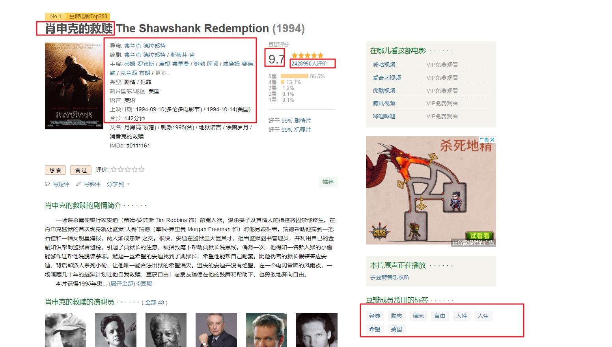

1、背景

电影.....

2、目的 分享分析内容，吸引粉丝

3、数据来源

​	分析需要哪些数据

​		爬虫 ： 抓取 数据

​		可能会遇到 反爬虫：

4、数据清洗 与 分析 ，伴随着可视化

-  分析哪些导演上榜次数较多
- 分析哪些主演上榜次数较多
- 分析哪些类型电影上榜次数较多
- 分析哪些 年份 数量较多
- 排名与评分是否有关系
- 观众喜欢给电脑打什么标签

5、分析可视化与报告

6、对决策的建议 ，对问题提出解决方案 等等等

