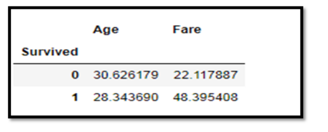
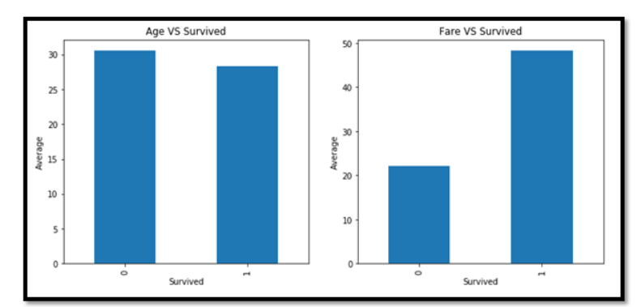
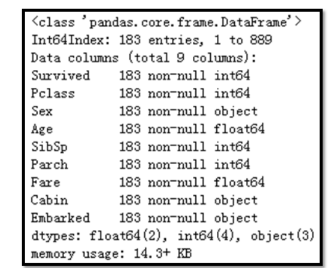

### 一、数据预处理及特征工程

#### 1、数值型与类别变量相关性分析

- **分析目标：**我们来分析 **Age** 年龄,**Fare** 船票价格与目标变量的 **Survived** 之间的相关性。
- **分析方法：**使用的方法是对 Survived 进行汇总（group by Survived)，统计生还和未生还两类乘客的 Age 均值差异。

```python
# 按 Survived 汇总，求 Age 和 Fare 的均值
titanic_df.groupby('Survived').agg({'Age':'mean','Fare':'mean'})
```



**结论：**生还和未生还的 Age 差异不算大，但是票价差异很大，生还乘客的票价要显著高于未生还乘客，这是可以理解的，因为生还乘客中 1 等舱比例较多

**分类汇总结果可视化**

```python
data = titanic_df.groupby('Survived').agg({'Age':'mean','Fare':'mean'})
plt.figure(figsize = (12,5))
plt.subplot(121)
data.Age.plot(kind='bar')
plt.title("Age VS Survived")
plt.ylabel('Average')
plt.subplot(122)
data.Fare.plot(kind='bar')
plt.title("Fare VS Survived")
plt.ylabel('Average')
plt.show()
```




思考：为什么要做变量的相关性分析？

答：通过相关性分析，筛选出对目标变量比较重要的特征变量，去除掉和目标变量无关的特征。降低特征冗余


#### 2、缺失值处理

- 直接删除带有缺失值的数据
- 构造新变量来标记缺失值
- 替换缺失值（用的最多）

**2.1、删除缺失值数据**

```python
# 删除整个数据集中任何一个变量有缺失的记录
dropna = titanic_df.dropna()
dropna.info()
```



**问题：** 删除后只有 183 条记录了，原来可是有 891 条记录啊，显然这样做不行啊


#### 3、类别变量编码

类别变量编码后需要满足以下两个基本要求：

- 要能数字体现
- 要有语义，即有具体意义


#### 4、变量的分箱

变量的分箱，也称为变量分段、分桶、变量离散化

**变量分箱优势：**

1. 分箱之后连续型变量就可以变成类别型变量来处理了，而类别型变量又可以进行独热编码
2. 变量分箱之后能让模型变得更稳健，不太容易过拟合

**变量分箱的类型**

1. 自定义分箱
2. 等宽分箱
3. 等深分箱

思考：在机器学习建模任务中，对于同一个变量，是否需要同时进行三种类型的分箱操作呢？

答：不需要，选择最优的一种即可（PS：具体哪种是最优，需要进行建模尝试）后续如果学习了决策树算法，决策算法可以用来对变量进行分箱，且决策树分箱的结果一般都比较好


