### 一、KNN算法

#### 1、针对数值的预测，能否用KNN思想？

小明的学历、年龄、工作年龄、从事行业和小张、小强、小王都很接近。而且他们四个人彼此之间都是好朋友。现在已知以下三个人的薪资水平

1. 小张：8500
2. 小强：9000
3. 小王：9500

问小明的薪资水平你觉得是多少？
$$
小明的薪资 = \frac{小张 + 小强 + 小王}{3} = 9000
$$


**KNN算法不仅能用于解决分类问题，还可以解决回归问题**


#### 2、如何寻找K个邻居

按照距离的远近去查找K个邻居，认为距离越近的样本，相似度越高

思考：如何度量两个样本之间的距离？


**2.1、欧式距离**

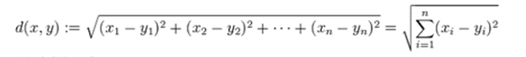

如下图所示：

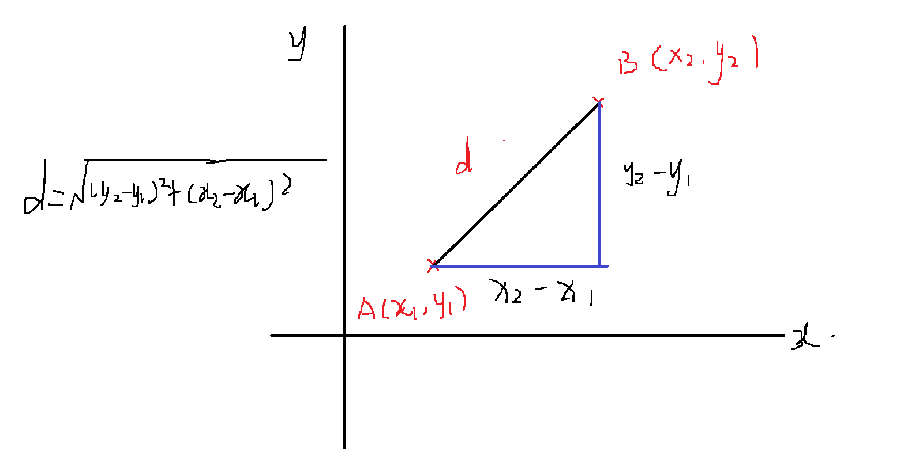


**2.2、曼哈顿距离**

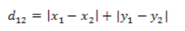

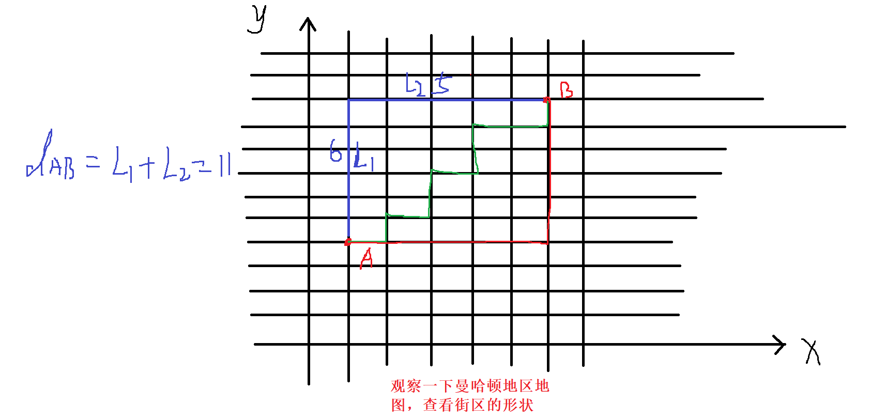

**2.3、闵可夫斯基距离**

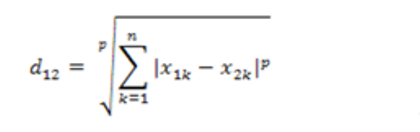

对于闵可夫斯基距离，主要核心参数是p，以下是p的两种常见的取值

1. p=1，闵可夫斯基距离所表示的就是曼哈顿距离
2. p=2，闵可夫斯基距离所表示的就是欧式距离


#### 3、KNN算法案例

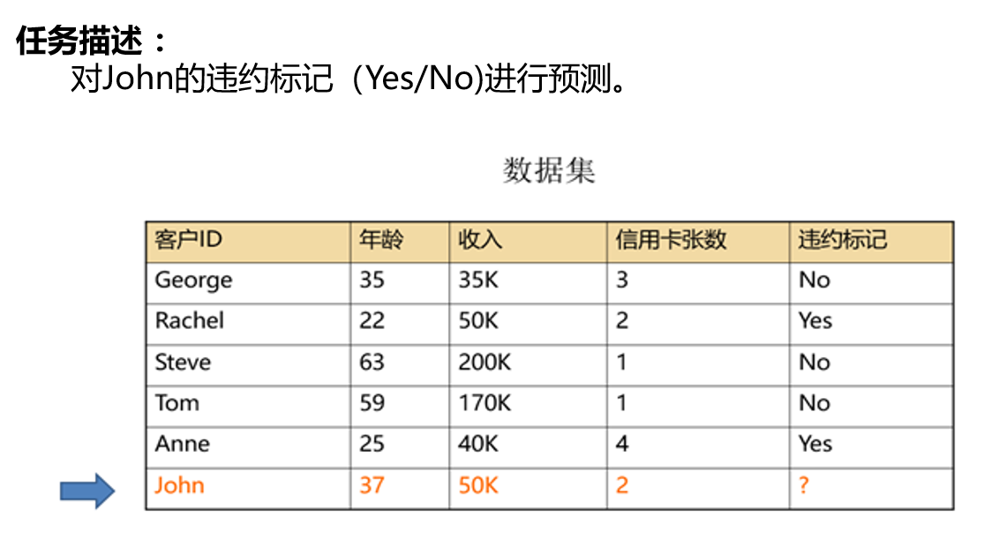

计算John分别与训练样本的距离并排序

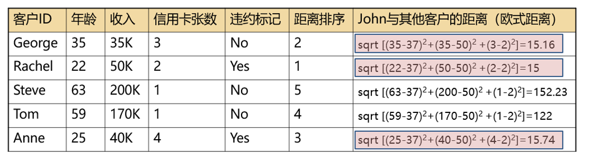

思考：以上计算方式是否存在问题，如果有，请说明？

答：年龄、收入以及信用卡张数等特征的量纲明显不一致，所有最好的做法应该是先对特征做标准化或者归一化，然后再计算距离并排序


#### 4、KNN算法是懒惰学习算法

K近邻算法只有模型预测，没有模型训练。通过前面的描述，我们发现K近邻这种算法和其他分类算法截然不同，它没有模型训练，只有模型预测。待预测的数据在训练数据中进行遍历搜索，寻找到它的K个邻居，然后根据邻居的分类值来对新数据进行预测。正因为它这种只有需要预测的时候才干活的特性，所以我们称它为懒惰算法，而别的算法都是要事先基于训练样本训练模型的。K近邻算法也被称为基于实例的学习算法。


#### 5、懒惰学习算法的优缺点

- 优点：  优点当然是简单
- 缺点：对存储空间的需求量很大，需要占用的空间直接取决于训练样本数据量的大小

假设现在有10亿个训练样本，现在需要根据这10亿个训练样本对一个新的样本做预测，那么需要完成以下步骤

+ 计算新的样本与10亿个训练样本的距离，得到10亿个距离
+ 再对10亿个距离进行从小到大排序
+ 筛选出排在前k个的邻居


### 二、KMeans 聚类算法

#### 1、KMeans 算法的基本知识

- KMeans算法通常也称之为K均值算法
- KMeans算法是属于聚类算法
- 聚类算法是训练模型的时候是没有目标变量的，所有聚类算法属于非监督学习算法
- KMeans算法是具有非常强的主观性的，采用算法和标准不一样，聚类结果往往也不一样


#### 2、什么是聚类分析

聚类是一种把相似数据合并在一起的方法，就是我们常说的“人以群分，物以类聚”。聚类是一种“非监督的学习算法”——事先并不需要有类别标注的样本来监督学习，而是直接从数据中学习模式。聚类是一种“数据探索”的分析方法，它帮助我们在大量的数据中探索发现数据结构。


#### 3、聚类与分类的区别

+ 分类问题中的类别标签是事先确定的，要解决的问题是对样本所属的标签进行预测
+ 聚类问题中数据对应的类是未知的，我们事先并不知道数据中可能会包含多少个类，聚类要解决的问题正是通过算法来发现隐藏在数据中的这些类


#### 4、Knn、KMeans等算法的特征处理

+ 标准化处理：把变量转换为均值为0方差为1
+ 归一化处理：把变量转换为最小值为0，最大值为1
+ 如果变量是类别型，例如性别，我们要把它用于距离计算，可以使用独热编码的方式先把变量转换为数值，然后再用上面的方面进行去量纲化处理


#### 5、聚类分析算法的分类

+ 基于划分（KMeans）

  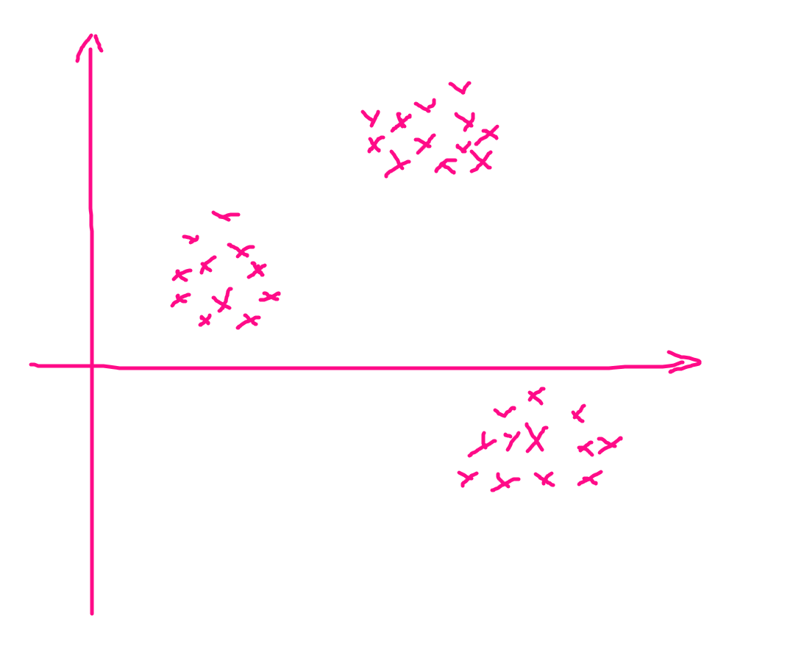

  上图所示，当样本的类别之间有明现的差异或者分界的时候，适合用基于划分的聚类算法

+ 基于密度（DBSCAN）

  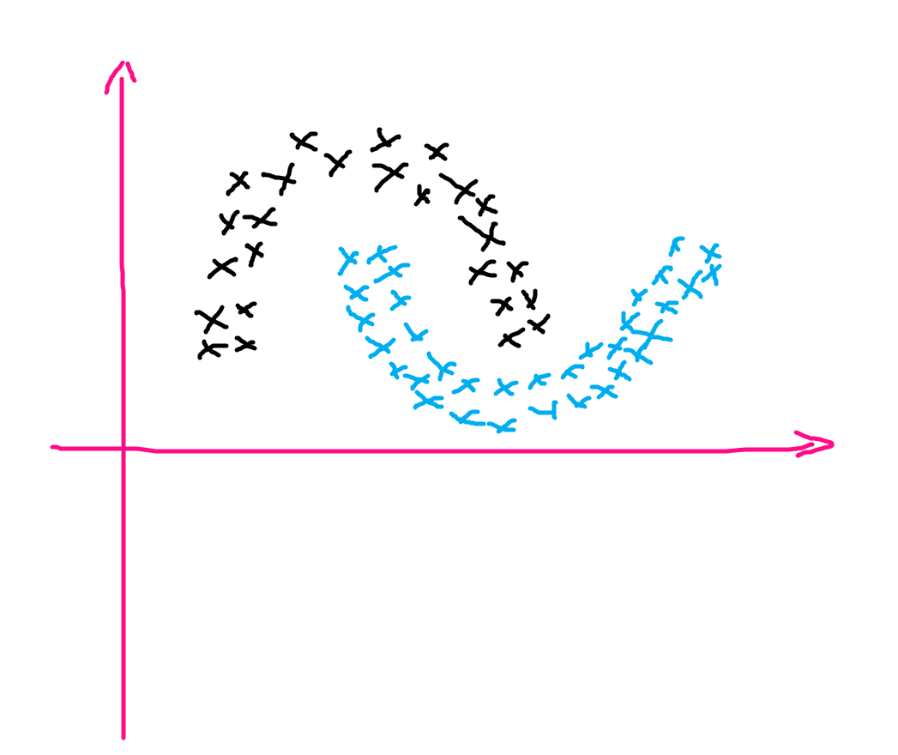

  ​	上图所示，当样本的类别之间没有明现的差异或者分界的时候，适合用基于密度的聚类算法


#### 6、聚类过程什么时候结束？

聚类过程结束，也成为聚类算法达到收敛的条件，算法收敛可以理解为模型训练结束

- 每个类别下的样本不在发生变化
- 每个类别下的类中心点位置不再发生改变


#### 7、思考：KNN算法中的K与KMeans算法中的K有何区别？


#### 8、KMeans算法的优缺点

**8.1、优点**

1. 算法原理简单，处理速度较快
2. 当数据点是密集的，且类与类之间区别明显时，效果较好（基于划分的聚类分析算法的特点）

**8.2、缺点**

1. K均值算法中的K值选定比较难（具有非常强主观性）
2. 对孤立点比较敏感
3. 结果不稳定，初始值（种子）的选定对结果有一定的影响


#### 9、如何优化KMeans算法K值的选取

1. 使用KMeans算法的改进版本，KMeans++或者二分KMeans算法

2. 使用肘部法选取K值

   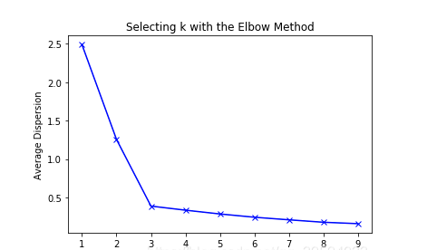

   思想：尝试用不同K值对数据进行聚类，以K值为横坐标，以Average Dispersion 为纵坐标，绘制出折线图，查看拐点的位置。上图中可以明显看出，拐点出现在K=3的地方


#### 10、所有样本距离聚簇中心点的总距离和

思考：以上的结果是越大越好还是越小越好？


### 三、线性回归算法

#### 1、什么是线性回归

回归问题 就是拟合 输入变量X 与 数值型 的 目标变量y 之间的 关系，而线性回归就是假定了X与y之间是线性关系，数学表示如下：
$$
y=f(x_{1},x_{2},x_{3}...)=w_{1}x_{1}+w_{2}x_{2}+w_{3}x_{3}+...+b
$$


#### 2、线性回归建模的前提

X和y具有相关性是进行回归建模的前提，X和y变量的类型不同，相关系数的计算方法也不同

+ X和y都是数值型变量 ：皮尔逊相关系数是衡量它们之间线性相关性的最佳选择
+ X和y都是类别型变量： 由于y是类别型变量，这个时候就是分类问题 了，用卡方值（chi-square）来衡量相关性
+ X和y中一个数值变量，一个类别变量：可以考虑用 Spearman相关系数


#### 3、相关性探索分析的方法

+ 数值型变量与数值型变量：散点图（scatter）
+ 类别型变量与类别型变量：交叉表（crosstab）
+ 数值型与类别变量：分类汇总统计（groupby）


#### 4、皮尔逊相关系数

在线性回归 问题中，我们最常用的是 皮尔逊相关系数，下图给出了皮尔逊相关系数的计算方法，以及不同的相关系数值对应的相关关系示意。皮尔逊相关系数的值在-1~1之间，正数表示正相关，负数表示负相关，1和-1表示绝对相关，就是说X和y完全落在一条直线上，这样的情况在机器学习中往往没有意义

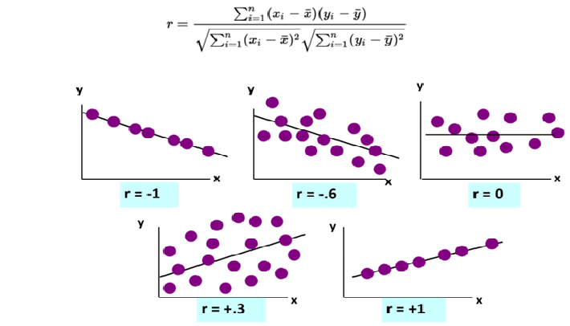

使用numpy求解皮尔逊相关系数案例

```python
import numpy as np
import pandas as pd
import matplotlib.pyplot as plt

x = np.array([1,3,5,7,9,11])
y = -2*x + 3

plt.scatter(x,y)
plt.show()
```

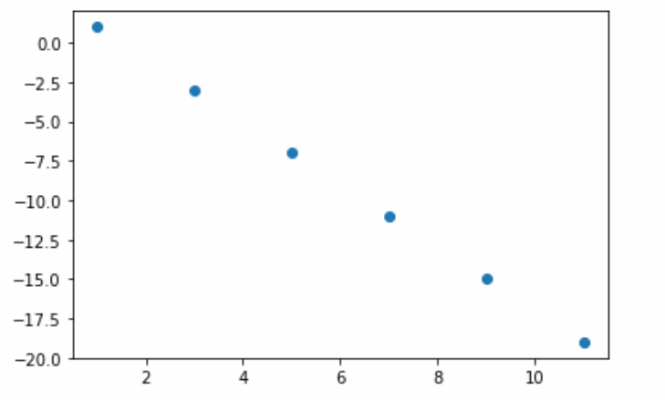

```python
# 使用numpy求解x与y的皮尔逊相关系数
np.corrcoef(x,y)
```

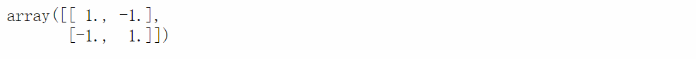

以上结果显示，x与y之间是绝对负相关

```python
# 生成一个10行两个列的随机数组
arr = np.random.randint(0,10,size=(10,2))
arr
```

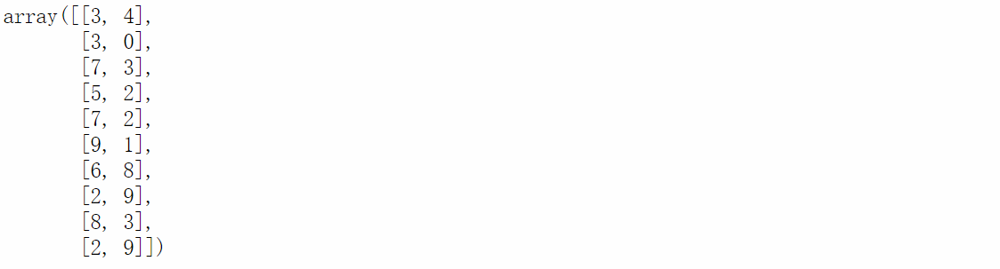

```python
# 绘制出数组第一列与第二列的散点图分布
plt.scatter(arr[:,0],arr[:,1])
plt.show()
```

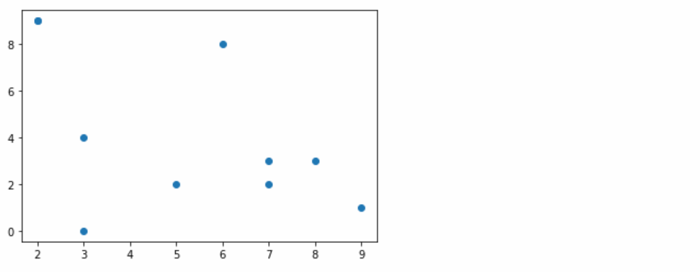

通过上图发现，数组的第一列与第二列之间不存在明现的相关性

```python
# 使用numpy求第一列和第二列的皮尔逊相关系数
np.corrcoef(arr[:,0], # 数组的第一列
            arr[:,1]) # 数组的第二列
```

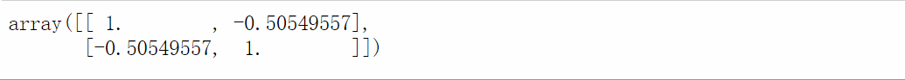

#### 5、最小二乘法

最小二乘法是一种求解回归模型参数$(w_{1},w_{2},w_{3},...,w_{n},b)$的方法，能够使模型找出拟合训练样本的最完美的直线。其思想是让模型的预测值与真实值的误差平方和最小，数学表达式如下
$$
min \sum_{i=1}^{n}(\hat{y}_{i} - y_{i})^2
$$
思考：最小二乘结果对于回归模型而言是越小越好还是越大越好？


#### 6、线性回归模型的损失函数

损失函数代表的是模型的预测值与真实值之间的差异大小，损失函数越小，说明差异就越小。模型效果就越好。在线性回归模型中，损失函数可以直接使用最小二乘的结果
$$
loss = min \sum_{i=1}^{n}(\hat{y}_{i} - y_{i})^2
$$
通常来说，不同算法，损失函数定义方法是不同的。无论损失函数如何定义，本质上都是反应模型预测值与真实值之间差异大小


#### 7、梯度下降算法

无论是最小二乘也好，还是梯度下降也好，模型训练的过程都是为了使模型的损失函数变小。梯度下降算法的核心思想使通过迭代逼近法寻找到让模型的损失函数取得最小值时的模型参数。

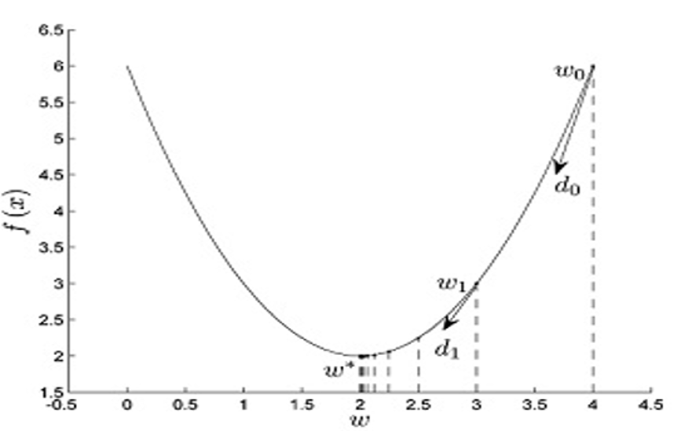

上图中，纵坐标 $f(x)$ 表示的是模型损失函数$loss$ 而横坐标 $w$ 表示模型的参数。关于梯度下降算法的一些注意事项

1. 梯度下降求得的参数只能无限逼近最优解，永远都达不到最优解
2. 梯度下降算法有一个重要参数叫学习率（learning rate）这个值一般不宜设置过大
3. 学习率设置过大，会导致损失函数呈现震荡下降
4. 学习率设置过小，模型收敛速度变慢
5. 梯度下降也许只能找到损失函数局部最优解，无法找到全局最优解
6. 因此就产生出了一些其他的优化算法：SGD（随机梯度下降）、Adam

**梯度下降算法代码实现案例**

```python
# 定义损失函数
def fun(x):
    return x**2 + 2*x + 1

# 定义损失函数的导数
def dfun(x):
    return 2*x + 2

# 定义梯度下降优化的一些参数
# 学习率
lr = 0.01
# 优化初始值
x = 2
# 梯度下降优化的次数
epochs = 1000


# 通过迭代，进行梯度下降
for epoch in range(epochs):
    # 使x朝着负梯度的方向优化
    x = x - lr*dfun(x)
    # 每完成一次迭代，输出x的值，以及损失函数的值
    print("第{}次迭代".format(epoch+1))
    print("x = ",x)
    print("loss = ",fun(x))
    print("***************************************")
```

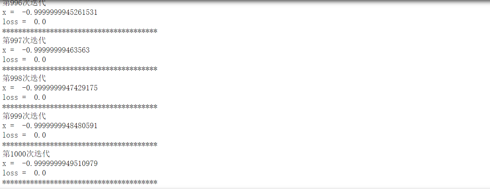

损失函数图像

```python
import numpy as np
import matplotlib.pyplot as plt

x = np.linspace(-3,1,200)
y = fun(x)
plt.plot(x,y)
plt.show()
```

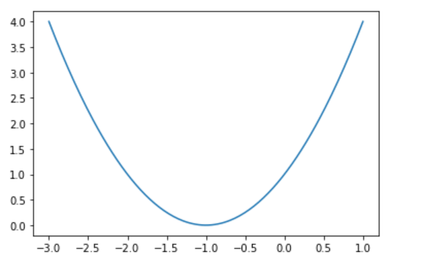

#### 8、模型参数以及超参数

**8.1、模型参数**

首先模型的参数是针对参数模型（线性回归、逻辑回归、SVM、神经网络）而言，模型的参数一般是指模型训练完成后所得到的关于模型目标函数的参数。例如线性回归模型目标函数如下：
$$
y=f(x_{1},x_{2},x_{3}...)=w_{1}x_{1}+w_{2}x_{2}+w_{3}x_{3}+...+b
$$
当线性回归模型训练完成后，也就得到线性回归模型的参数，即$(w_{1},w_{2},w_{3},...,w_{n},b)$ 模型的参数在模型训练完成之前一般是未知。


**8.2、模型超参数**

模型训练前的选项和配置我们称为超参数，简单说就是模型训练之前需要设定的一些参数，比如KNN和KMeans算法中的K值，就是在模型训练之前就需要指定的参数，它们就称之为模型的超参数

```python
from sklearn.cluster import KMeans

# KMeans模型的实例化
km = KMeans(n_clusters=centers,  # 将所有的样本聚为4个类
            random_state=28)     # 随机数，用于随机选取中心点

from sklearn.neighbors import KNeighborsClassifier
# 实例化模型并训练
model = KNeighborsClassifier(n_neighbors=5)
model.fit(X_train,y_train)
```

以上KMeans模型的实例化过程中，`n_cluster` `random_state` 就是KMeans模型的超参数

以上KNeighborsClassifier模型的实例化过程中，`n_neighbors` 就是KNN模型的超参数


